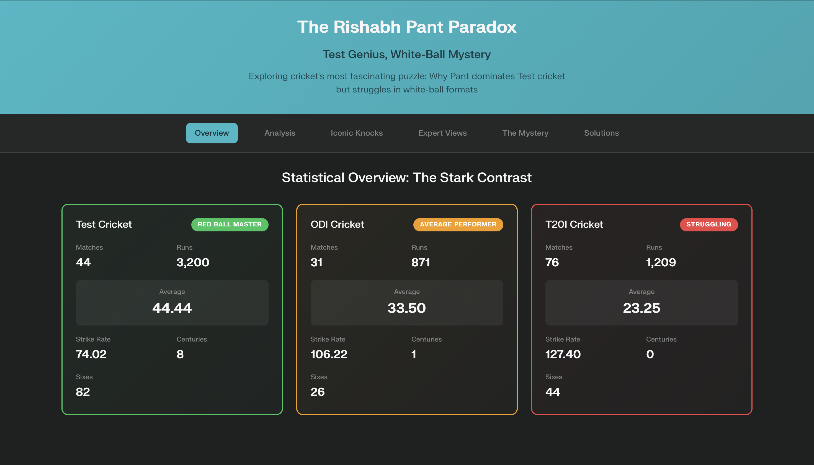
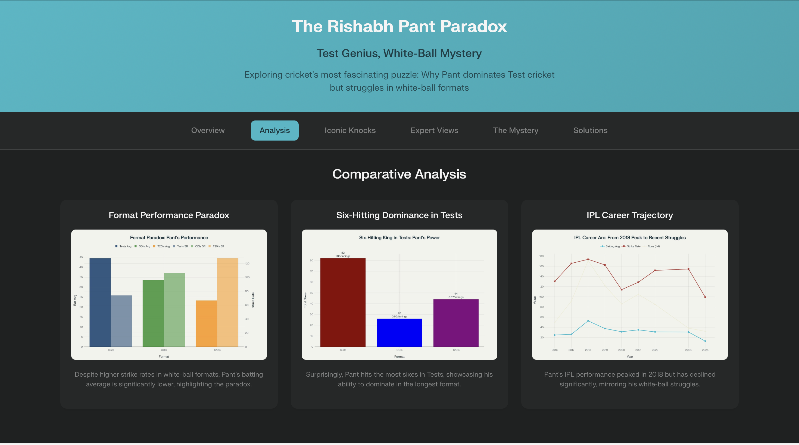
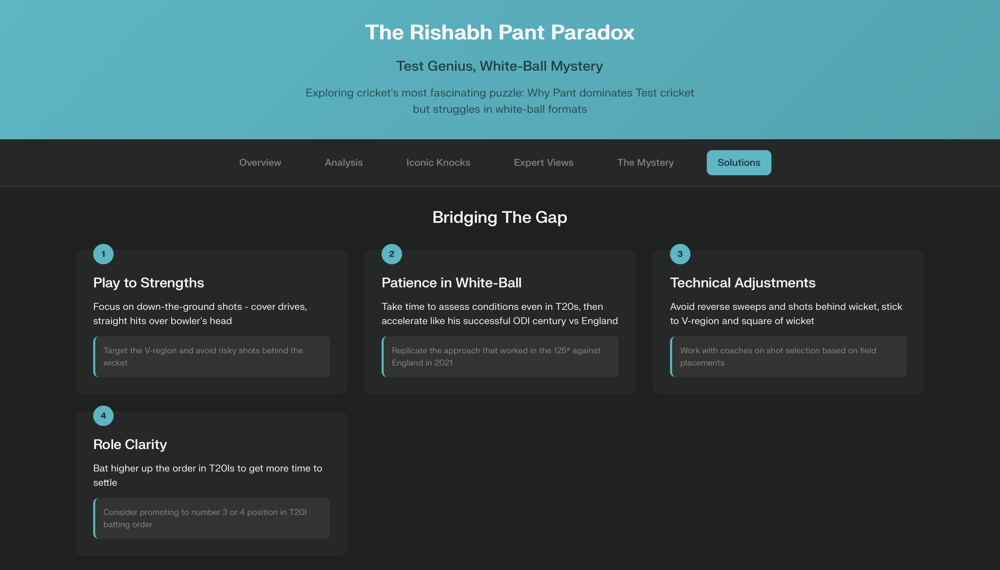

# The Rishabh Pant Paradox: A Cricket Analytics Dashboard

This project is a single-page, interactive web dashboard that explores the fascinating paradox of Rishabh Pant's cricket career: his dominance in Test cricket versus his struggles in white-ball formats.

The dashboard is built with plain HTML, CSS, and JavaScript, focusing on a clean UI and data visualization to tell a compelling story.

## Features

-   **Interactive Sections:** A single-page application experience with smooth navigation between different analysis sections.
-   **Statistical Overview:** A clear, side-by-side comparison of Pant's career stats in Test, ODI, and T20I formats.
-   **Visual Analysis:** Includes charts visualizing his performance, six-hitting ability, and IPL career trajectory.
-   **Responsive Design:** The layout is fully responsive and works on desktops, tablets, and mobile devices.
-   **Light/Dark Mode:** Automatically adapts to your system's color scheme for comfortable viewing.

## Live Demo

You can view the live dashboard here: [https://piyushiitk24.github.io/pant-cricket-dashboard/](https://piyushiitk24.github.io/pant-cricket-dashboard/)

## Screenshots

### Overview


### Analysis


### Iconic Knocks


### Expert Views


### The Mystery


### Solutions


## Tech Stack

-   **HTML5:** For the structure and content of the page ([index.html](index.html)).
-   **CSS3:** For all styling, including a modern design system with CSS variables, responsive layouts, and theming ([style.css](style.css)).
-   **Vanilla JavaScript:** For all client-side interactivity, including section navigation and event handling ([app.js](app.js)).

## How to Run

You can view the live dashboard directly on GitHub Pages: [https://piyushiitk24.github.io/pant-cricket-dashboard/](https://piyushiitk24.github.io/pant-cricket-dashboard/)

To run it locally, this is a static website. Simply open the `index.html` file in your web browser.

For the best experience during local development, you can serve the files using a local web server. If you have Node.js installed, you can use a simple server like `http-server`:

```sh
# Install http-server globally
npm install -g http-server

# Run the server in the project directory
http-server
```

Then, open your browser and navigate to the provided local address.

## File Structure

-   `index.html`: The main entry point containing the structure and content of the dashboard.
-   `style.css`: Contains all the styling rules for the application.
-   `app.js`: Handles all the interactivity, such as switching between sections.
-   `pant_*.png`: Image assets used for the charts in the analysis section.
-   `images/`: Contains screenshots of the different sections of the dashboard.